<div id="top"><div>

# LOGINAPP

## ABOUT THE PROJECT
The goal of the application is to create a user login/logout and registration system.

<p align="right">(<a href="#top">back to top</a>)</p>

## HOW TO USE THE APPLICATION

The application will work by displaying  pages:
1) SignUp;
2) SignIn;
3) Dashboard;
4) Edit;
5) PageNotFound

<p align="right">(<a href="#top">back to top</a>)</p>

### SIGN UP:

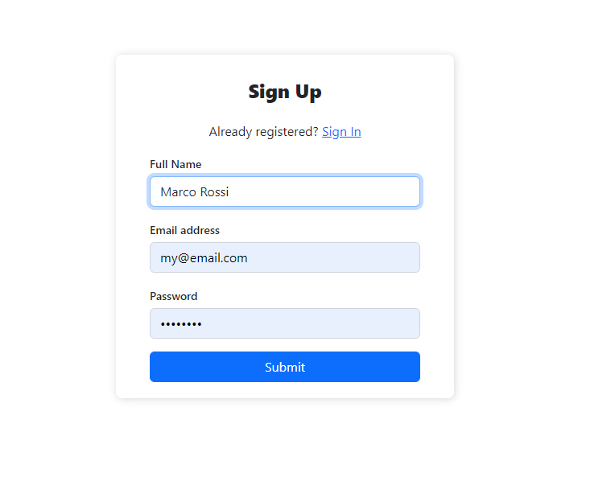

The sign up page allows the user to be able to create their personal account.

This page consists of 3 textfields as below in the image

During registration, 3 types of errors could occur that would not lead to successful account registration:

#### Email already registered

In the case that the registration email is contained within the database.

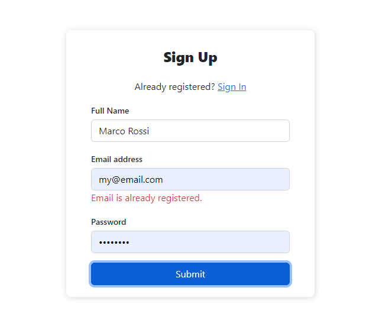

#### Name must contain at least 6 characters

In the case that, within the textfield "Full name" you have not typed at least 6 characters the following error will appear:

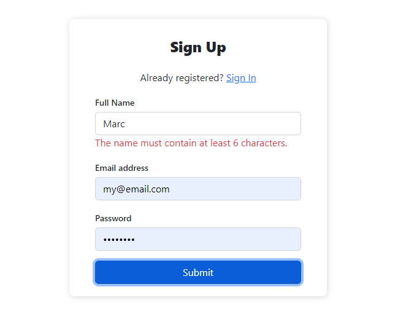

#### Password must contain at least 6 characters

In the case that, within the textfield "password" you have not typed at least 6 characters the following error will appear:

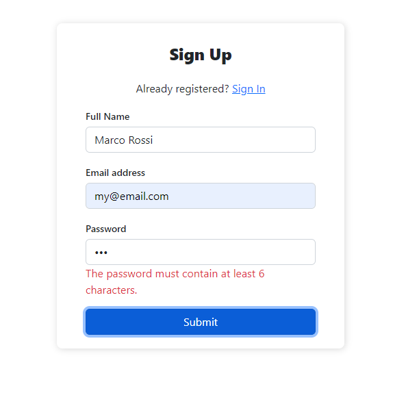

##### Invalid email format:

This error occurs when the entered email does not meet the minimum requirements such as the "@" or the "." followed by the domain.

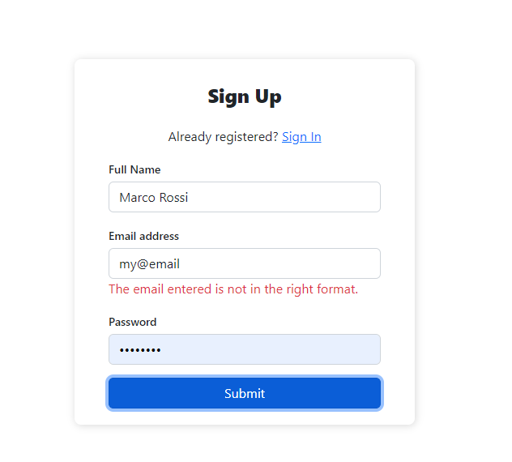


### SIGN IN:

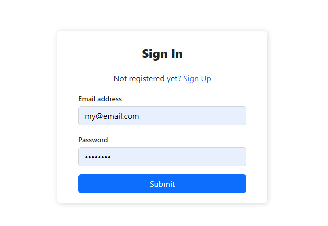

This page allows the user to access their account (if previously created).

The user will need to enter their email and password (chosen during registration).

If the data entered is correct, the user will be automatically redirected to their dashboard.

If the data entered does not exist within the database or should not be correct, the following error message will appear:

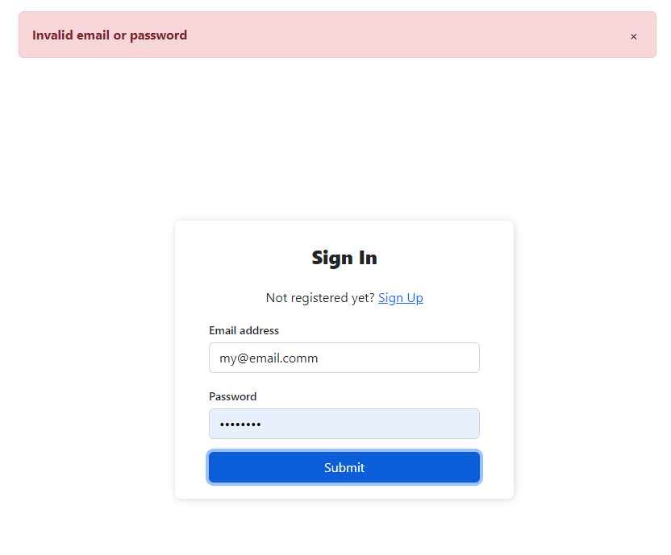

### DASHBOARD

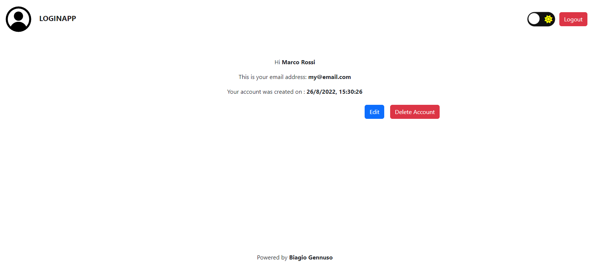

The dashboard is the main page of a user's account. 
Within the dasboard you will be able to read about your profile information com the name, email date and time of account creation.

The dashboard also consists of the logo at the top right and 4 buttons with which you can interact:

1) Toggle Dark Mode;
2) Edit;
3) Logout;
4) Delete account

#### Toggle Dark Mode


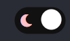

This button allows you to change the color of your theme.
The changes will remain even after logging out.

#### Edit 


This button allows you to be rinderized to the page where you will be able to make changes to your data.

#### Logout

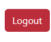

This button allows the user to log out of their login session.

#### Delete account

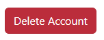

This button allows the user to be able to delete their account and all data about them within our database.

### EDIT

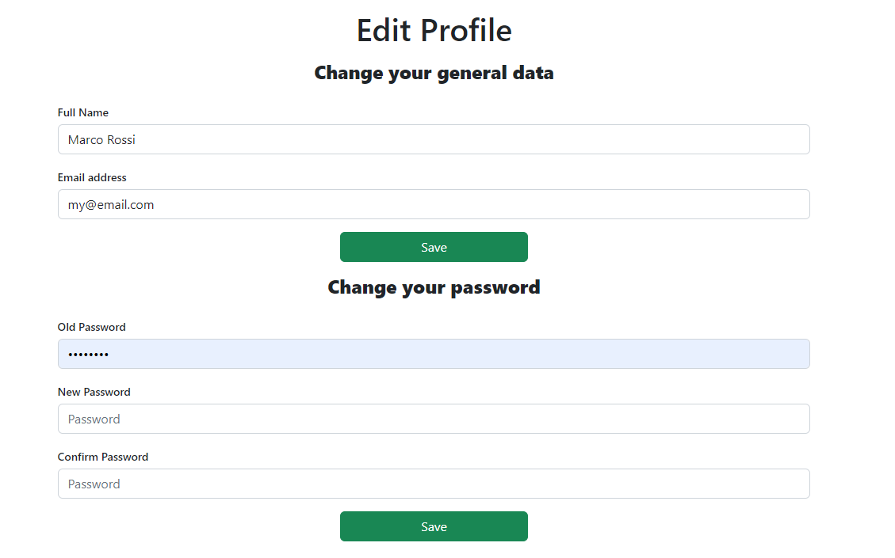

On this page the user will be allowed to change their data (name, email and password).

In order to be able to make the password change you will first have to enter the password currently in use and then the new password that you will have to repeat a second time.

In the textfileds of the edit page the same rules apply as in the case of registration, such as character limit, email in the right format, etc..

### PAGENOTFOUND


This page will be possible to view, only in case the user tries to access in a non-existing path.

## ROUTES:

The site consists of 4 routes, 2 of which are protected (user needs to be logged in for access):

### Free routes:

1) ``` '/signin' ```,
2) ``` '/signup' ```.

### Protected routes:

1) ``` '/dashboard' ```,
2) ``` '/edit' ```.

In case the user tries to access non-existing routes he will be automatically inderiorated to the error page.

<p align="right">(<a href="#top">back to top</a>)</p>

## APPLICATION DEPENDENCIES

### FRONT-END

#### AXIOS:

Axios is a Javascript library used to make HTTP requests from XMLHttpRequests from the browser and it supports the Promise API. It can be used intercept HTTP requests and responses and enables client-side protection against XSRF.

#### BOOTSTRAP

The most popular front-end framework for developing responsive, mobile first projects on the web

#### REACT-ROUTER-DOM

React Router is a fully-featured client and server-side routing library for React, a JavaScript library for building user interfaces. React Router runs anywhere React runs; on the web, on the server with node.js, and on React Native.

<p align="right">(<a href="#top">back to top</a>)</p>

### BACK-END

#### BCRYPTJS

Bcrypt allows building a password security platform that can evolve alongside hardware technology to guard against the threats that the future may bring.

#### BODY-PARSER

Node.js body parsing middleware.

Parse incoming request bodies in a middleware before your handlers, available under the req.body property.

#### CORS

CORS is a node.js package for providing a Connect/Express middleware that can be used to enable CORS with various options.

#### DOTENV

Dotenv is a zero-dependency module that loads environment variables from a .env file into process.env. Storing configuration in the environment separate from code is based on The Twelve-Factor App methodology.

#### EXPRESS

Fast, unopinionated, minimalist web framework for node.

#### JSONWEBTOKEN

JSON Web Token (JWT) is a compact, URL-safe means of representing claims to be transferred between two parties. 
The claims in a JWT are encoded as a JSON object that is used as the payload of a JSON Web Signature (JWS) structure or as the plaintext of a JSON Web Encryption (JWE) structure, enabling the claims to be digitally signed or integrity protected with a Message Authentication Code (MAC) and/or encrypted.

#### MONGOOSE

Mongoose is a MongoDB object modeling tool designed to work in an asynchronous environment. Mongoose supports both promises and callbacks.

#### PASSPORT

Passport's sole purpose is to authenticate requests, which it does through an extensible set of plugins known as strategies. Passport does not mount routes or assume any particular database schema, which maximizes flexibility and allows application-level decisions to be made by the developer. The API is simple: you provide Passport a request to authenticate, and Passport provides hooks for controlling what occurs when authentication succeeds or fails.

#### PASSPORT-JWT

A Passport strategy for authenticating with a JSON Web Token.

This module lets you authenticate endpoints using a JSON web token. It is intended to be used to secure RESTful endpoints without sessions.

<p align="right">(<a href="#top">back to top</a>)</p>

## TEST THE APPLICATION

The backend has been uploaded to **Heroku**.

Want to try the application? You can try the app on [Netlify](https://biagiologinapp.netlify.app/)

<p align="right">(<a href="#top">back to top</a>)</p>

## CONTACTS

Email: [gennuso.biagio@gmail.com](mailto:gennuso.biagio@gmail.com)

Github: [LoginApp](https://github.com/bilabixxx/Loginapp)

<p align="right">(<a href="#top">back to top</a>)</p>